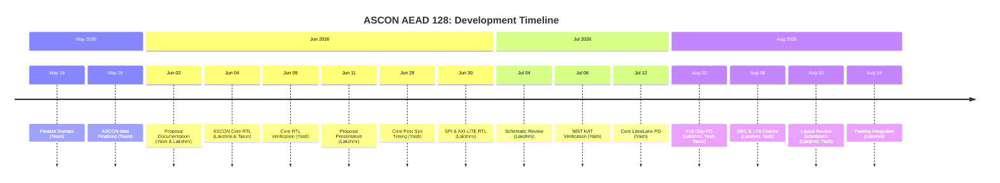

<div align="center">
  

  # Team CryptoAccel: ASCON AEAD128a Hardware Accelerator
  
  
  
  
  
  
  
</div>

<br>

## 📖 Overview

Team CryptoAccel proposes a lightweight hardware accelerator implementing the **ASCON-AEAD128a** authenticated encryption algorithm, standardized by NIST ([SP 800-232](https://nvlpubs.nist.gov/nistpubs/SpecialPublications/NIST.SP.800-232.pdf)). It is designed for resource-constrained applications such as IoT security, secure boot, and root-of-trust.

This accelerator is built in synthesizable Verilog and taken through a complete open-source RTL-to-GDSII flow using an open-source toolchain targeting the **GlobalFoundries 180nm (GF180MCU)** process.

### 🏆 Project Highlights
- **Event**: IEEE SSCS Chipathon Pico 2026 (Track A)
- **Target Node**: Global Foundries 180 nm PDK
- **Proposal Rank**: 2nd out of 35 (Score: 3.17/4.0)
- **Schematic Review**: Unconditional GO (Score: 10/15)
- **Repositories**: 
  - [Main Repository](https://github.com/lakshmikiyer/SSCS_CHIPATHON_2026_CRYPTOACCEL/tree/main)
  - [Padring Integration Repository](https://github.com/lakshmikiyer/Chipathon-2026-A10_Cryptoaccel/tree/main)

---

## 🔗 Resources & Links

| Resource | Link |
|----------|------|
| 📄 **Project Proposal** | [View Document ↗](https://docs.google.com/document/d/e/2PACX-1vQ7hXiJkHFsaxKhHVbuH3Zd8qZDoJdL6WpXG3n53tD7aNz_2QSCsUlUvai5AVLdPrBWiSDReBhnfogW/pub) |
| 🐛 **GitHub Issue** | [View Issue #44 ↗](https://github.com/sscs-ose/sscs-chipathon-2026/issues/44) |
| 📊 **Progress Tracker** | [View Tracker ↗](https://github.com/lakshmikiyer/SSCS_CHIPATHON_2026_CRYPTOACCEL/blob/main/Progress%20Tracker/readme.md) |
| 🎥 **Proposal Presentation** | [Watch on YouTube ↗](https://youtu.be/4pfbP2isbxA?si=O9V1pwiTxTNE5hqo) |
| 🎥 **Schematic Review Video** | [Watch on Drive ↗](https://drive.google.com/file/d/1Om1IALZSBtE1XGMmxLGU7RnFuSFpBlrm/view) |
| 🎥 **Layout Review Video** | [Watch on Drive ↗](https://drive.google.com/file/d/1Z2raVcPt4EsP0nf7BELFfiN4O5xUtK46/view) |

---

## 🏗️ Architecture & Implementation

<div align="center">
  
  <br>
  <em>ASCON Core Architecture</em>
</div>

### Final Chip Summary
The final integrated chip runs at **16 MHz** and is structured as follows:

```text
chip_top (padring + I/O pads)
  └── chip_core
       └── spi_slave (top module)
            ├── axi_master
            ├── axi_ascon (AXI-Lite wrapper)
            │    └── ascon_core_adpt_encdec
            │         ├── ascon_round_s1
            │         └── ascon_round_s2
            └── reset_sync
```

- **Interface**: SPI slave (communicates with external MCU/FPGA master)
- **Internal Bus**: AXI-Lite (connects SPI frontend to ASCON crypto backend)
- **Crypto Core**: ASCON-AEAD128a (full encryption, decryption, and tag verification)
- **Target**: GF180MCU padring via LibreLane

### Physical Layouts
<p align="center">
  
  &nbsp; &nbsp; &nbsp;
  
  <br>
  <em>Left: Hardened ASCON Macro &nbsp; | &nbsp; Right: Full Chip Integrated with GF180 Padring</em>
</p>

---

## 📅 Project Timeline



---

## 📂 Repository Structure

```text
ascon128/
├── RTL_Design_Verification/       # ASCON core RTL design & cocotb/Verilog testbenches
│   ├── design/
│   │   ├── core_non_pipelined.v   # Non-pipelined ASCON core
│   │   └── core_pipelined.v       # Pipelined ASCON core
│   └── verification/
│       ├── coco_tb.py             # Cocotb testbench
│       ├── ascon_golden_model.py  # Python golden model
│       └── tb.v                   # Verilog testbench
│
├── synthesis/                     # Yosys synthesis (GF180MCU)
│   ├── ascon_core_adpt_encdec.nl.v
│   ├── reports/                   # Synthesis reports
│   └── yosys-synthesis.log
│
├── post_synthesis_GLS/            # Post-synthesis gate-level simulation
│   ├── ascon_core_PostSYN_GLS/    # Core-level GLS
│   ├── ascon_full_GLS_postSYN/    # Full design post-synth & post-PnR GLS
│   └── Coco_TB_trial/             # Cocotb-based GLS
│
├── physical_design/               # Physical design runs via LibreLane
│   ├── LibreLane_4jul/            # Early run
│   └── librelane_12jul_Working/   # Working run with deliverables
│
├── chip_top_integration/          # Final chip-level integration (from padring repo)
│   ├── src_cryptoaccel/           # SPI slave, AXI wrapper, ASCON core RTL, OpenLane config
│   ├── padring_top/               # chip_top.sv, chip_core.sv, pad mapping
│   ├── macro/                     # Hardened spi_slave macro (GDS, LEF, LIB, netlists, SPEF)
│   ├── gds_Cryptoaccel/           # GDS output (dry run)
│   └── librelane_cryptoaccel/     # LibreLane run results & metrics
│
├── ip_pkg_assembly/               # IP-XACT component packaging & SoC assembly via Kactus2
│
├── ascon_core_adpt_encdec.gds     # Core GDS (standalone)
├── ascon_core_adpt_encdec.lef     # Core LEF (standalone)
├── ascon_core_adpt_encdec.nl.v    # Core netlist (standalone)
└── README.md
```

---

## 👥 The Team

<div align="center">
  
</div>
<br>

| Name | Discord | Affiliation | Role | Experience | Key Contributions |
|---|---|---|---|---|---|
| **Lakshmi K Iyer** | `lakvlsi_90908` | IIT, Bombay | Team Lead | Ph.D. Research Scholar | RTL Core Design & Architecture, Interface RTL, Chip-Top Integration (Design, Verification, GLS, Initial PD), Team Management |
| **Yashvardhan Singh** | `zysteresis` | MIT, Manipal / STMicroelectronics | Team Member | Undergraduate (III) | Design/Post-Synth Verification, PD via LibreLane, Chip-Top PD (Max-Cap/Slew Fixes), Standalone DRC/LVS, IP-XACT Packaging & Assembly, Documentation & VCS |
| **Tarun R S** | `tarun_rs05` | IIIT, Bangalore | Team Member | Undergraduate (II) | RTL Design, PD via ORFS, ERC & OEB Checks |
